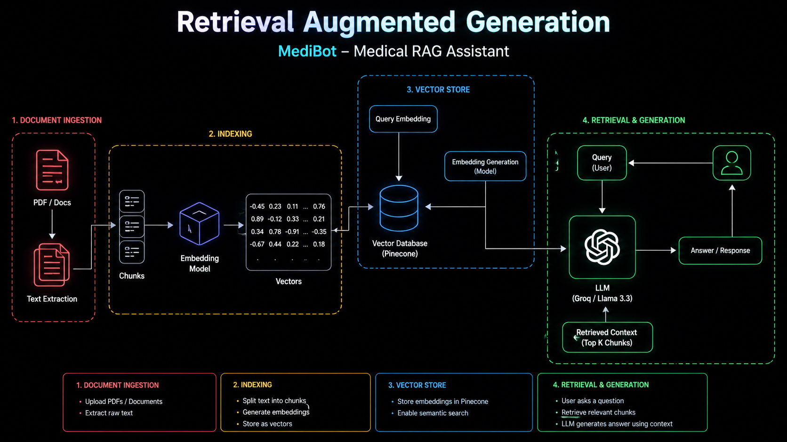

# 📅 AI Medical Assistant Chatbot — RAG-based Application


---

## 🧠 Project Overview

This project is a Medical AI Assistant built using RAG (Retrieval-Augmented Generation). Users can upload medical PDF documents and ask questions through an AI chatbot.

The system uses Google Generative AI Embeddings, Pinecone Vector DB, and Groq LLaMA 3 to retrieve relevant context and generate accurate responses.

The backend is developed with FastAPI and LangChain, while the frontend is built using HTML.
---

## 🎓 What is RAG?

**RAG (Retrieval-Augmented Generation)**  improves AI responses by retrieving relevant information from external documents before generating answers. This reduces hallucinations and increases accuracy, especially in specialized domains such as **medicine**.

---

## 🔄 Architecture

```
User Input
   ↓
Query Embedding → Pinecone Vector DB ← Embedded Chunks ← Chunking ← PDF Loader
   ↓
Retrieved Docs
   ↓
     RAG Chain (Groq + LangChain)
   ↓
LLM-generated Answer
```

(./assets/MedicalAssistant.pdf)**

---

## 📚 Features

- Upload medical PDFs (notes, books, etc.)
- Auto-extracts text and splits into semantic chunks
- Embeds using Google/BGE embeddings
- Stores vectors in **Pinecone DB**
- Uses **Groq's llama-3.3-70b-versatile** via LangChain
- FastAPI backend with endpoints for file upload and Q\&A

---

## 🌐 Tech Stack

| Component  | Tech Used                  |
| ---------- | -------------------------- |
| LLM        | Groq API (LLaMA3-70B)      |
| Embeddings | Google Generative AI       |
| Vector DB  | Pinecone                   |
| Framework  | LangChain                  |
| Backend    | FastAPI                    |


---

## 📚 API Endpoints

```http
POST /upload_pdfs/ --- Upload one or more PDF files

POST /ask/ --- Ask a question --- Form field: `question`

```

---

## 📁 Folder Structure

```
└── 📁assets
    ├── DIABETES.pdf
```

```

```
└── 📁backend
    └── 📁__pycache__
        ├── logger.cpython-311.pyc
        ├── main.cpython-311.pyc
        ├── test.cpython-311.pyc
    └── 📁middlewares
        └── 📁__pycache__
            ├── exception_handlers.cpython-311.pyc
        ├── exception_handlers.py
    └── 📁modules
        └── 📁__pycache__
            ├── llm.cpython-311.pyc
            ├── load_vectorstore.cpython-311.pyc
            ├── query_handlers.cpython-311.pyc
        ├── llm.py
        ├── load_vectorstore.py
        ├── pdf_handlers.py
        ├── query_handlers.py
    └── 📁routes
        └── 📁__pycache__
            ├── ask_question.cpython-311.pyc
            ├── upload_pdfs.cpython-311.pyc
        ├── ask_question.py
        ├── upload_pdfs.py
    └── 📁uploaded_docs
        ├── DIABETES.pdf
       
    ├── .env
    ├── logger.py
    ├── main.py
    ├── requirements.txt
    └── test.py
```

---

## ⚡ Quick Setup

```bash
# Clone the repo
$ git clone 
$ cd MEDICAL-RAG-ASSISTANT/backend

# Create virtual env
$ uv venv
$ .venv/bin/activate  # Windows: venv\Scripts\activate

# Install dependencies
$install -r requirements.txt

# Set environment variables (.env)
GOOGLE_API_KEY=...
GROQ_API_KEY=...
PINECONE_API_KEY=...

## 🎉 License

This project is licensed under the MIT License.
